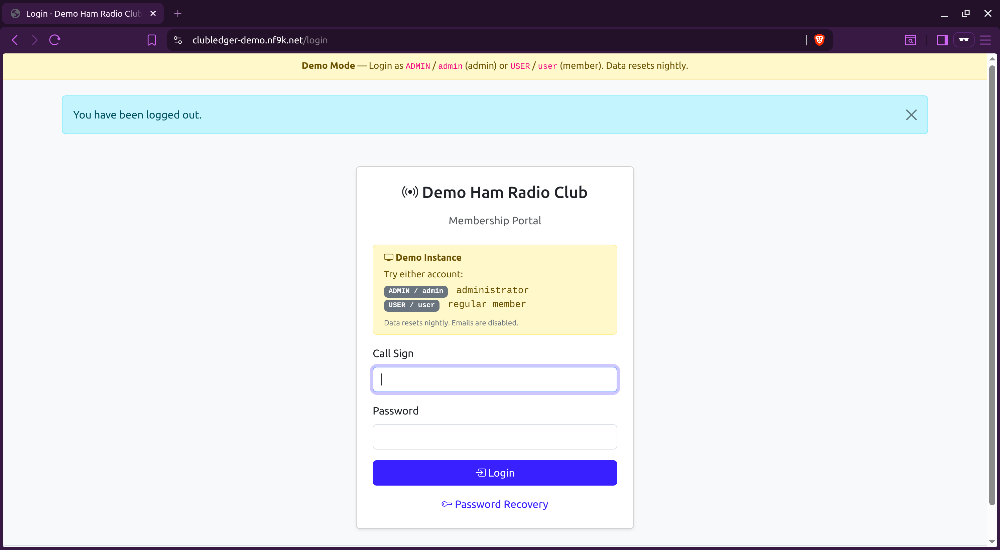
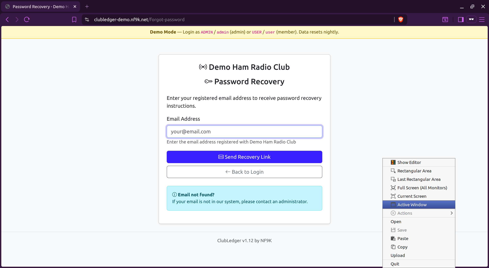
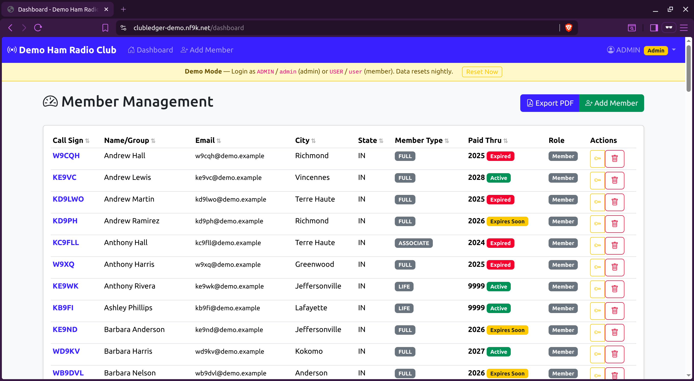
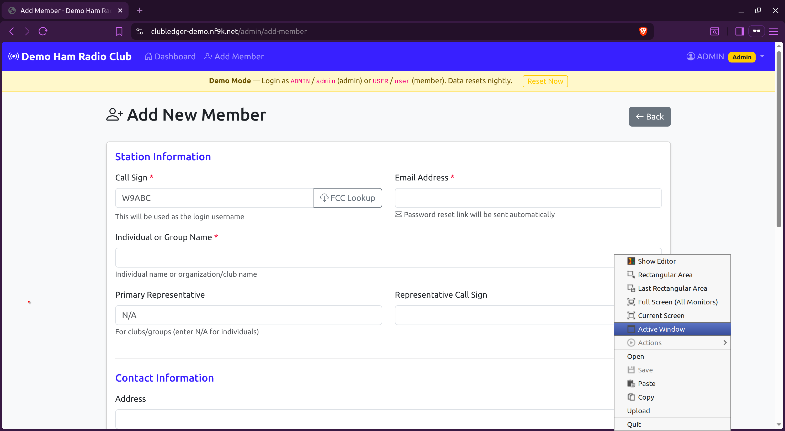
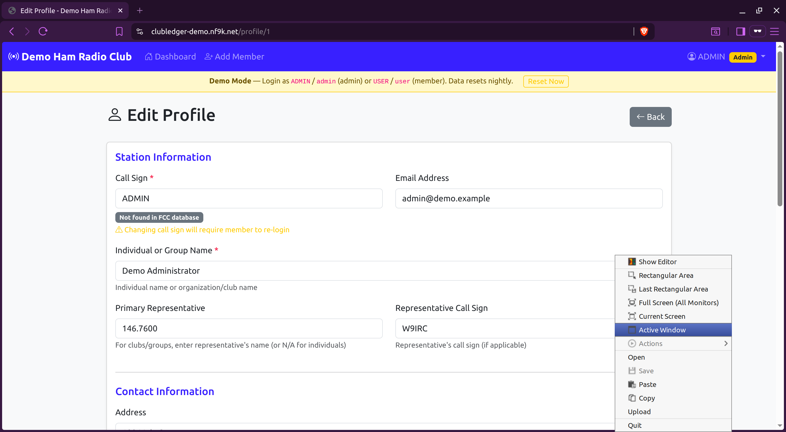
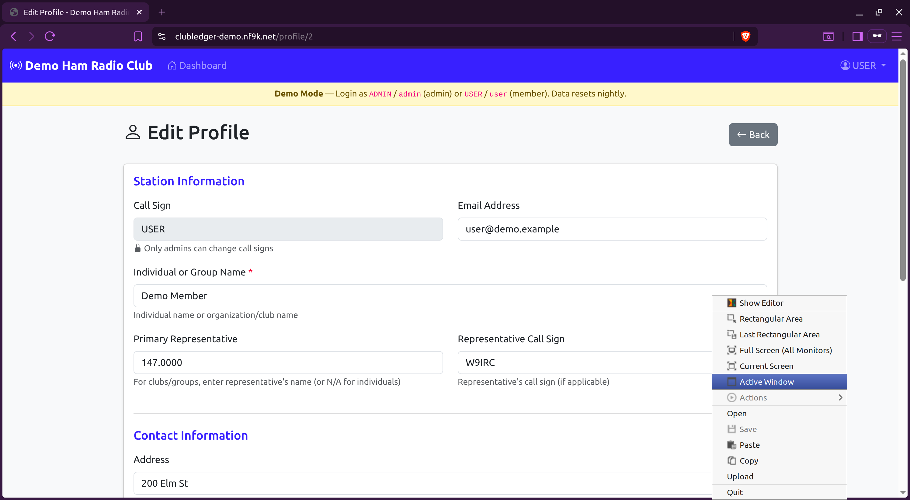

# ClubLedger — Ham Radio Club Membership Portal

A self-hosted web application for managing ham radio club membership records. Members log in with their call sign to view and update their own information. Administrators manage the full member list, track dues, export rosters, and receive automated expiration notifications.

**Current version: v1.11**

---

## Features

- Call sign + password authentication with bcrypt
- **hCaptcha** on login and password recovery (optional — inactive unless keys are configured)
- **Two-factor authentication** — TOTP (Google Authenticator, Authy, etc.), hardware security keys (YubiKey / WebAuthn), and 8 one-time backup codes
- Member self-service: update contact details, change password, manage 2FA
- Admin dashboard with sortable columns and status badges (Active / Expiring / Expired)
- Add, edit, and delete members
- **FCC ULS lookup** — admins can look up any call sign against a local copy of the FCC amateur license database (~1.68M records), with one-click sync to member profile
- Automatic record change emails — members receive a field-by-field diff whenever their record is saved
- Automated expiration notifications via cron — emails sent only when status actually changes
- PDF roster export, sorted by last name
- Admin-only internal comments field (not visible to members)
- Password reset via email link (24-hour tokens)
- Fully configurable org branding via environment variables

---

## Stack

- **Backend**: Python 3.13 / Flask 3.0, Flask-Login, Flask-Mail
- **Database**: MariaDB 11
- **Auth**: bcrypt, pyotp (TOTP), py_webauthn (FIDO2/WebAuthn), hCaptcha
- **PDF**: reportlab
- **Email**: any SMTP provider (SMTP2GO recommended)
- **Deployment**: Docker + Docker Compose

---

## Quick Start

### Prerequisites

- Docker and Docker Compose
- An SMTP account (SMTP2GO or similar)

### 1. Clone and configure

```bash
git clone <repo-url> clubledger
cd clubledger
cp .env.example .env
```

Edit `.env` — at minimum set these values:

```env
SECRET_KEY=change-this-to-a-random-string

DB_ROOT_PASSWORD=
DB_USER=membership_user
DB_PASSWORD=
DB_NAME=clubledger_db

SMTP_HOST=mail.smtp2go.com
SMTP_PORT=587
SMTP_USER=
SMTP_PASSWORD=
SMTP_FROM_EMAIL=noreply@yourclub.org

APP_URL=https://members.yourclub.org

# Org branding
ORG_NAME=Your Club Name
SERVICE_DESK_URL=help.yourclub.org
LOGO_FILENAME=logo.png
ADMIN_EMAILS=admin1@yourclub.org,admin2@yourclub.org
```

### 2. Add your logo (optional)

Copy your logo file into `static/` and set `LOGO_FILENAME` in `.env`. If omitted, the org name renders as text on the login page.

### 3. Start the containers

```bash
docker compose up -d
```

The database schema is applied automatically on first start. No manual migrations needed for a fresh install.

### 4. Create your first admin account

```bash
docker exec -it clubledger_db mariadb -u root -p"${DB_ROOT_PASSWORD}" "${DB_NAME}"
```

```sql
INSERT INTO members (call_sign, password_hash, email, name, is_admin)
VALUES ('W9ABC', '<bcrypt-hash>', 'admin@yourclub.org', 'Your Name', 1);
```

To generate a bcrypt hash:

```bash
python3 -c "import bcrypt; print(bcrypt.hashpw(b'yourpassword', bcrypt.gensalt()).decode())"
```

### 5. Set up expiration notifications (optional)

```bash
crontab -e
# Add:
0 9 * * * docker exec clubledger_web python3 /app/scripts/check_expirations.py >> /var/log/clubledger_expirations.log 2>&1
```

### 6. Import FCC license data (optional)

Enables call sign lookup and profile sync in the admin interface.

```bash
# Full import (~1.68M records, runs once, takes a few minutes)
docker exec clubledger_web python3 /app/scripts/import_fcc.py

# Daily incremental updates — add to crontab:
0 3 * * * docker exec clubledger_web python3 /app/scripts/import_fcc.py --daily >> /var/log/fcc_import.log 2>&1
```

---

## Upgrading an Existing Install

Pull the new image and run any new migration files before restarting:

```bash
# Example: upgrading to v1.06 (adds 2FA support)
docker exec -i clubledger_db mariadb -u root -p"${DB_ROOT_PASSWORD}" "${DB_NAME}" < database/add_2fa.sql
docker compose pull web && docker compose up -d --force-recreate web
```

---

## Org Branding

Four environment variables control all club-specific text throughout the app, emails, and PDF exports. No code changes needed.

| Variable | Description | Default |
|----------|-------------|---------|
| `ORG_NAME` | Full organisation name | `Ham Radio Club` |
| `SERVICE_DESK_URL` | Support URL shown in emails and password recovery | *(omit for generic text)* |
| `LOGO_FILENAME` | Filename in `static/` for login page logo | *(omit to show org name as text)* |
| `ADMIN_EMAILS` | Comma-separated list for expiration summary emails | *(none)* |

---

## File Structure

```
clubledger/
├── app/
│   ├── app.py              ← Flask application (all routes)
│   ├── twofa.py            ← 2FA helpers (TOTP, backup codes, WebAuthn)
│   └── requirements.txt
├── templates/
│   ├── base.html           ← Shared layout
│   ├── dashboard.html
│   ├── profile.html
│   ├── twofa/              ← 2FA templates
│   │   ├── challenge.html
│   │   ├── security.html
│   │   ├── setup_totp.html
│   │   ├── backup_codes.html
│   │   └── webauthn_register.html
│   └── …
├── static/                 ← Logo and static assets (volume-mounted)
├── database/
│   ├── schema.sql                  ← Full schema (auto-applied on fresh install)
│   ├── add_admin_comments.sql      ← Migration: v2.1 → v2.2
│   ├── add_expiration_tracking.sql ← Migration: v2.1 → v2.2
│   ├── add_fcc_lookup.sql          ← Migration: adds fcc_licenses table
│   └── add_2fa.sql                 ← Migration: adds 2FA tables/columns
├── scripts/
│   ├── import_fcc.py               ← FCC ULS import (full + daily)
│   ├── check_expirations.py        ← Expiration notification cron
│   ├── run_expiration_check.sh
│   └── backup_and_email.sh
├── documentation/          ← Administrator and member guides
├── Dockerfile
└── docker-compose.yml
```

---

## Environment Variables — Full Reference

```env
# Application
SECRET_KEY=
APP_URL=

# Database
DB_HOST=db
DB_USER=membership_user
DB_PASSWORD=
DB_NAME=clubledger_db
DB_ROOT_PASSWORD=

# SMTP
SMTP_HOST=mail.smtp2go.com
SMTP_PORT=587
SMTP_USER=
SMTP_PASSWORD=
SMTP_FROM_EMAIL=

# Org branding
ORG_NAME=
SERVICE_DESK_URL=
LOGO_FILENAME=
ADMIN_EMAILS=

# hCaptcha (optional — omit or leave blank to disable)
HCAPTCHA_SITE_KEY=
HCAPTCHA_SECRET_KEY=

# Demo mode (optional — enables demo banner, /demo/reset endpoint, disables SMTP)
#DEMO_MODE=false
#DEMO_RESET_TOKEN=change-me-to-a-random-secret
```

---

## Demo Mode

Set `DEMO_MODE=true` to run a public demo instance. This enables:

- Login page banner with demo credentials (`ADMIN` / `admin`, `USER` / `user`)
- Navbar banner on all pages indicating demo mode
- Admin "Reset Now" button to reload seed data on demand
- `POST /demo/reset?token=<DEMO_RESET_TOKEN>` endpoint for cron-based nightly resets
- All outgoing email silently suppressed

A sample deployment is available at [clubledger.nf9k.net](https://clubledger.nf9k.net).

See `deploy/demo/` for a ready-to-use Docker Compose setup with Traefik labels.

To regenerate demo seed data: `python3 scripts/generate_demo_seed.py`

---

## Verification Checklist

After deployment:

- [ ] Login works (admin and regular member)
- [ ] Dashboard displays with sortable columns
- [ ] Adding a member sends password reset email
- [ ] Admin comments field visible on profile (admins only)
- [ ] PDF export downloads and sorts by last name
- [ ] Status badges show correct colours
- [ ] Save a profile change — member receives diff email
- [ ] Password reset emails send correctly
- [ ] hCaptcha widget appears on login and password recovery (if keys configured)
- [ ] Security & 2FA page accessible from user dropdown
- [ ] TOTP setup: scan QR code, verify, receive backup codes
- [ ] FCC lookup button on Add Member populates name/address
- [ ] FCC comparison card on admin profile view loads and highlights differences

---

## Screenshots

### Login


### Forgot Password


### Admin Dashboard


### Add Member


### Member Profile (Admin View)


### Member Profile (Member View)


### FCC Lookup Card


### Change Password


### Security & 2FA


### TOTP Setup


### WebAuthn Registration


### Backup Codes


### 2FA Challenge


### PDF Export


---

## License

This project is licensed under the [GNU General Public License v3.0](LICENSE).
